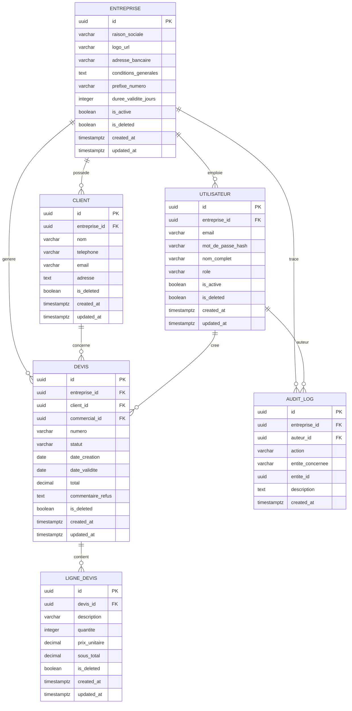

## Section 1 : Entités et attributs

### entreprise

| Colonne | Type PostgreSQL | Contraintes | Description |
|---|---|---|---|
| id | UUID | PRIMARY KEY, DEFAULT gen_random_uuid() | Identifiant unique de l'entreprise |
| raison_sociale | VARCHAR(255) | NOT NULL | Nom ou raison sociale de l'entreprise |
| logo_url | VARCHAR(500) | NULL | URL du logo stocké dans le bucket Supabase |
| adresse_bancaire | VARCHAR(500) | NULL | Coordonnées bancaires de l'entreprise |
| conditions_generales | TEXT | NULL | Conditions générales de vente |
| prefixe_numero | VARCHAR(10) | NOT NULL, DEFAULT 'DEV' | Préfixe utilisé pour la numérotation des devis |
| duree_validite_jours | INTEGER | NOT NULL, DEFAULT 30 | Durée de validité par défaut des devis (J+30) |
| is_active | BOOLEAN | NOT NULL, DEFAULT true | Statut actif/inactif de l'entreprise |
| is_deleted | BOOLEAN | NOT NULL, DEFAULT false | Soft-delete de l'entreprise |
| created_at | TIMESTAMPTZ | NOT NULL, DEFAULT now() | Date de création |
| updated_at | TIMESTAMPTZ | NOT NULL, DEFAULT now() | Date de dernière modification |

### utilisateur

| Colonne | Type PostgreSQL | Contraintes | Description |
|---|---|---|---|
| id | UUID | PRIMARY KEY, DEFAULT gen_random_uuid() | Identifiant unique de l'utilisateur |
| entreprise_id | UUID | NOT NULL, FOREIGN KEY → entreprise.id | Entreprise de rattachement |
| email | VARCHAR(255) | NOT NULL, UNIQUE | Adresse email de connexion |
| mot_de_passe_hash | VARCHAR(255) | NOT NULL | Hash du mot de passe (géré par Supabase Auth) |
| nom_complet | VARCHAR(255) | NOT NULL | Nom complet de l'utilisateur |
| role | VARCHAR(20) | NOT NULL, CHECK IN ('commercial', 'manager') | Rôle de l'utilisateur |
| is_active | BOOLEAN | NOT NULL, DEFAULT true | Statut actif/inactif |
| is_deleted | BOOLEAN | NOT NULL, DEFAULT false | Soft-delete de l'utilisateur |
| created_at | TIMESTAMPTZ | NOT NULL, DEFAULT now() | Date de création |
| updated_at | TIMESTAMPTZ | NOT NULL, DEFAULT now() | Date de dernière modification |

### client

| Colonne | Type PostgreSQL | Contraintes | Description |
|---|---|---|---|
| id | UUID | PRIMARY KEY, DEFAULT gen_random_uuid() | Identifiant unique du client |
| entreprise_id | UUID | NOT NULL, FOREIGN KEY → entreprise.id | Entreprise de rattachement |
| nom | VARCHAR(255) | NOT NULL | Nom ou raison sociale du client |
| telephone | VARCHAR(20) | NOT NULL | Numéro de téléphone du client |
| email | VARCHAR(255) | NULL | Email optionnel du client |
| adresse | TEXT | NULL | Adresse optionnelle du client |
| is_deleted | BOOLEAN | NOT NULL, DEFAULT false | Soft-delete du client |
| created_at | TIMESTAMPTZ | NOT NULL, DEFAULT now() | Date de création |
| updated_at | TIMESTAMPTZ | NOT NULL, DEFAULT now() | Date de dernière modification |

### devis

| Colonne | Type PostgreSQL | Contraintes | Description |
|---|---|---|---|
| id | UUID | PRIMARY KEY, DEFAULT gen_random_uuid() | Identifiant unique du devis |
| entreprise_id | UUID | NOT NULL, FOREIGN KEY → entreprise.id | Entreprise de rattachement |
| client_id | UUID | NOT NULL, FOREIGN KEY → client.id | Client concerné par le devis |
| commercial_id | UUID | NOT NULL, FOREIGN KEY → utilisateur.id | Commercial créateur du devis |
| numero | VARCHAR(20) | NOT NULL, UNIQUE | Numéro automatique DEV-YYYY-XXXX |
| statut | VARCHAR(20) | NOT NULL, DEFAULT 'brouillon', CHECK IN ('brouillon', 'en_attente', 'valide', 'refuse') | Statut du devis dans le workflow |
| date_creation | DATE | NOT NULL, DEFAULT CURRENT_DATE | Date de création du devis |
| date_validite | DATE | NOT NULL | Date de validité du devis (défaut J+30) |
| total | DECIMAL(15,2) | NOT NULL, DEFAULT 0.00 | Total calculé du devis |
| commentaire_refus | TEXT | NULL | Commentaire optionnel en cas de refus |
| is_deleted | BOOLEAN | NOT NULL, DEFAULT false | Soft-delete du devis |
| created_at | TIMESTAMPTZ | NOT NULL, DEFAULT now() | Date de création |
| updated_at | TIMESTAMPTZ | NOT NULL, DEFAULT now() | Date de dernière modification |

### ligne_devis

| Colonne | Type PostgreSQL | Contraintes | Description |
|---|---|---|---|
| id | UUID | PRIMARY KEY, DEFAULT gen_random_uuid() | Identifiant unique de la ligne |
| devis_id | UUID | NOT NULL, FOREIGN KEY → devis.id | Devis parent |
| description | VARCHAR(500) | NOT NULL | Description de la prestation |
| quantite | INTEGER | NOT NULL, CHECK (quantite > 0) | Quantité de la prestation |
| prix_unitaire | DECIMAL(15,2) | NOT NULL, CHECK (prix_unitaire > 0) | Prix unitaire en FCFA |
| sous_total | DECIMAL(15,2) | NOT NULL | Sous-total calculé (quantite × prix_unitaire) |
| is_deleted | BOOLEAN | NOT NULL, DEFAULT false | Soft-delete de la ligne |
| created_at | TIMESTAMPTZ | NOT NULL, DEFAULT now() | Date de création |
| updated_at | TIMESTAMPTZ | NOT NULL, DEFAULT now() | Date de dernière modification |

### audit_log

| Colonne | Type PostgreSQL | Contraintes | Description |
|---|---|---|---|
| id | UUID | PRIMARY KEY, DEFAULT gen_random_uuid() | Identifiant unique de l'entrée |
| entreprise_id | UUID | NOT NULL, FOREIGN KEY → entreprise.id | Entreprise concernée |
| auteur_id | UUID | NOT NULL, FOREIGN KEY → utilisateur.id | Utilisateur à l'origine de l'action |
| action | VARCHAR(50) | NOT NULL | Type d'action (ex: creation, modification, validation, refus, suppression_logique) |
| entite_concernee | VARCHAR(50) | NOT NULL | Nom de l'entité concernée (ex: devis, client, utilisateur) |
| entite_id | UUID | NOT NULL | Identifiant de l'entité concernée |
| description | TEXT | NOT NULL | Description détaillée de l'action |
| created_at | TIMESTAMPTZ | NOT NULL, DEFAULT now() | Horodatage de l'action |

## Section 2 : Relations

| Entité A | Cardinalité | Entité B | Description |
|---|---|---|---|
| entreprise | 1:N | utilisateur | Une entreprise a plusieurs utilisateurs (commercial ou manager). Un utilisateur appartient à une seule entreprise. |
| entreprise | 1:N | client | Une entreprise a plusieurs clients dans son annuaire. Un client appartient à une seule entreprise. |
| entreprise | 1:N | devis | Une entreprise génère plusieurs devis. Un devis appartient à une seule entreprise. |
| client | 1:N | devis | Un client peut être associé à plusieurs devis. Un devis concerne un seul client. |
| utilisateur | 1:N | devis | Un commercial crée plusieurs devis. Un devis est créé par un seul commercial. |
| devis | 1:N | ligne_devis | Un devis contient plusieurs lignes de prestation (max 50). Une ligne appartient à un seul devis. |
| entreprise | 1:N | audit_log | Une entreprise génère plusieurs entrées d'audit. Une entrée d'audit concerne une seule entreprise. |
| utilisateur | 1:N | audit_log | Un utilisateur est l'auteur de plusieurs actions auditées. Une entrée d'audit a un seul auteur. |

## Section 3 : Diagramme ER (Mermaid)

